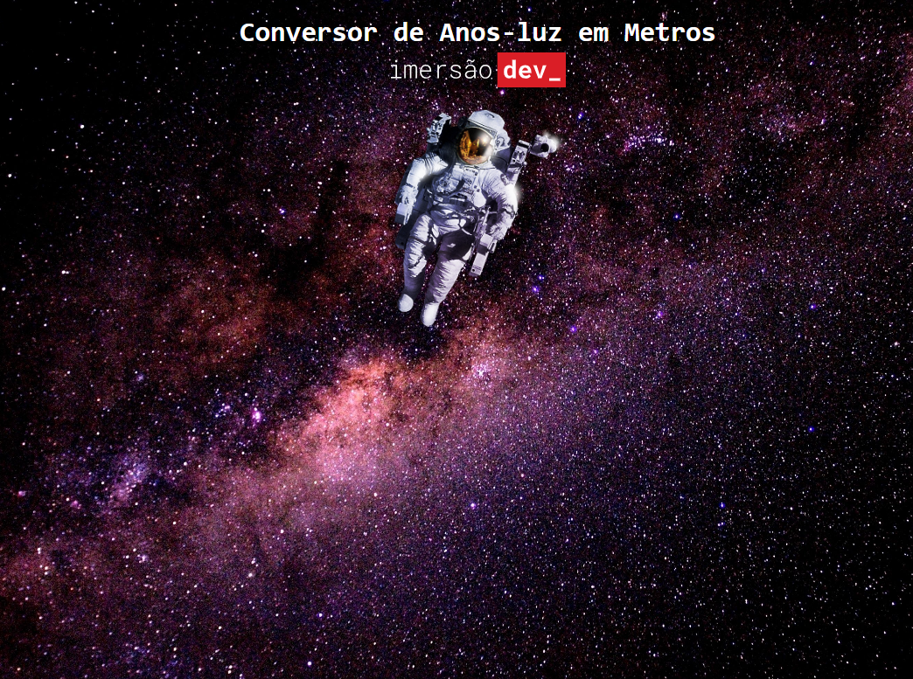
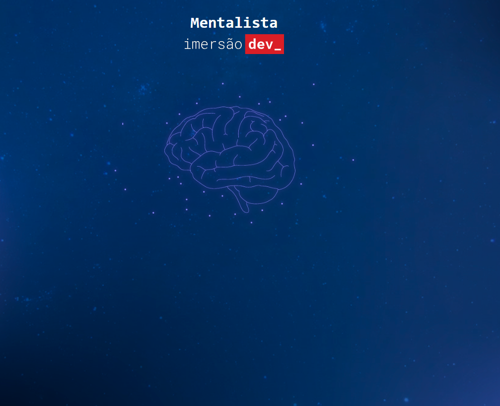
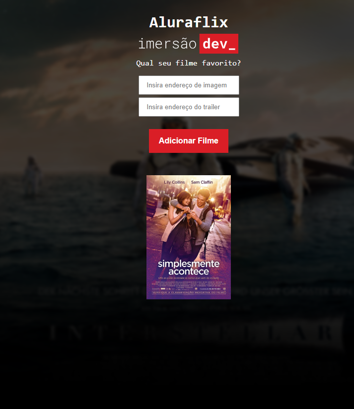
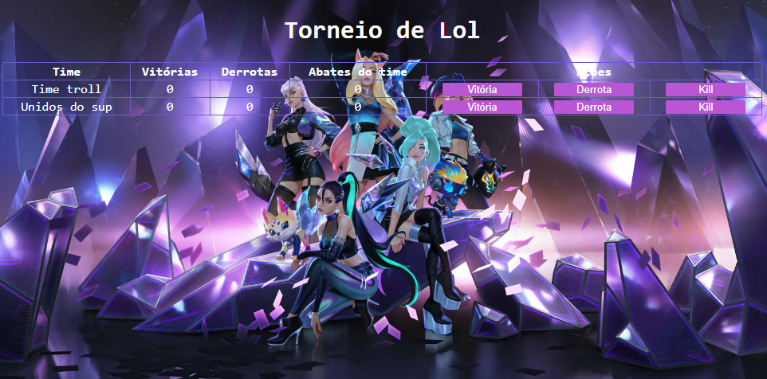

# imersaoDEV

### AULA 01 👨‍🚀

- DESAFIO 1: Converter Real em Bitcoin
- DESAFIO 2: Alert que recebe o nome do usuário
- DESAFIO 3: Converter anos luz em metros
 

  

      
### AULA 02 🧠

- DESAFIO 1: Informar se o 'chute' é menor ou maior que o número secreto
- DESAFIO 21: Informar a quantidade de tentativas que o jogador já fez até o momento 
- DESAFIO 3: O jogo deve ter o intervalo de 1 a 1000 e não de 0 a 1000
- DESAFIO 4: Informar e limitar o número máximo de tentativas para acertar o número secreto
 

  

### AULA 03 🎥

- DESAFIO 1: Trocar 'for' por 'while'
- DESAFIO 2: Garantir que o final da imagem seja .jpg 
- DESAFIO 3: Criar uma lista para guardar os nomes dos filmes e esses nomes aparecer em baixo dos pôsteres
 

  

### AULA 04 🍿

- DESAFIO 1: O que acontece se inserir um link que não é um a imagem? Restringir isso
- DESAFIO 2: Quando clicar na imagem do filme, ele redireciona para o trailer do youtube
- DESAFIO 3: Manter uma lista dos filmes adicionados e trailer
 

  

### AULA 05  🎮

- DESAFIO 1: Adicionar outros jogadores, usando listas
- DESAFIO 2: Personalizar a tabela, para um jogo que você gosta.
 

  

